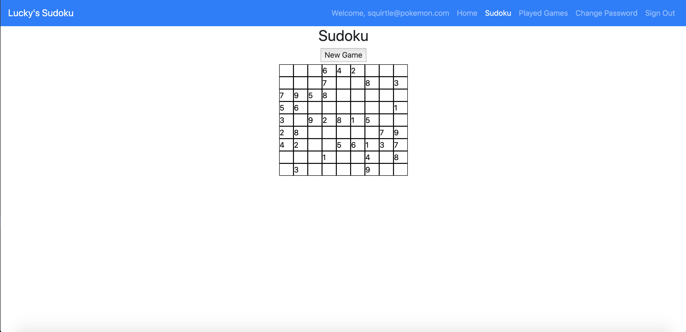
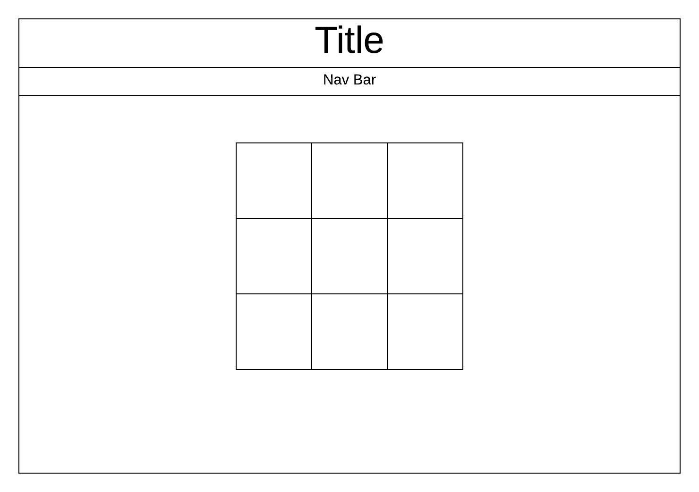

# Lucky's Sudoku

This application generates Sudoku puzzles that the user can then solve. It also
allows the user to view puzzles they have worked on previously and delete them
from their history. I am a big fan of Sudoku puzzles and so I wanted to try
building an application that could generate those puzzles.

## Setup Steps

1. Fork and clone this repository.
2. Run `npm install` to install all dependencies
3. Use `npm run start` to spin up the server.

## Important Links

- [API Repo](https://github.com/luckyswims/sudoku-api)
- [Deployed API](https://luckyswims-sudoku.herokuapp.com/)
- [Deployed Client](https://luckyswims.github.io/sudoku-client/#/)

## Planning Story

While planning for this project I knew the game board was going to be a major
hurdle to overcome, due to the numerous inputs and values the game app would
need to track. My plan was to have the board be a component containing 81 cell
components. This would allow me to track the state of the board while updating
each cell independently.

I started by making a Game component, which would contain a header, a button for
starting a new game, and the GameBoard component. When the Game component is 
called, it makes a request to the API for a new board. It then calls the 
GameBoard, passing it a startingBoard prop. The GameBoard then renders an input
for each item in the array. When the GameBoard is initially called, the 
startingBoard is an empty array, so nothing is rendered. When the Game component
receives a response from the API, it then re-renders, calling the GameBoard
component again, but this time with the startingBoard populated with the API's
response.

When I initially tested the page the Game component was rendering, and I was
getting my response back from the API, but the GameBoard wasn't rendering. I
checked my state and props using React developer tools that are available in
Chrome, and noticed that the state was updating correctly for the Game component
and the props were updating, but my state for my GameBoard wasn't updating.
After spending some time console logging items, and eventually pulling in a
second set of eyes I discovered that I wasn't referencing my props correctly in
my GameBoard.

Once I fixed the issue with my props, I discovered that my GameBoard still
wasn't rendering. My props, and state were fine, so I figured it had to be an
issue with my JSX. I had been trying to compose my JSX inside my useEffect
statement so that it would update once the startingBoard was passed in. However,
after working on it for a while, I realized that the useEffect function was
triggering a re-render which was resetting the variable where I was calling my
JSX. Having identified the issue, I pulled my code for rendering the initial
board out of the useEffect, and rewrote it to render the board after each update.
That finally resolved the problem and my board was displayed correctly.

With the GameBoard rendering, I just had to style it to look like a Sudoku board.
I setup the board as a CSS grid with 9 columns, and formatted the cells to have
the same width and height. After applying the formatting I finally had a working
Sudoku board.

### User Stories

- As a user I want to be able to sign up
- As a registered user I want to be able to sign in
- As a signed in user I want to be able to generate a sudoku board
- As a signed in user I want to be able to make moves on a generated sudoku board
- As a returning user I want to be able to see my statistics

### Technologies Used

- React
- HTML/CSS
- Bootstrap
- JavaScript

### Unsolved Problems

- Still need to prevent users from updating cells that were set by the starting board.
- Still need to check if the user's input is valid
- Still need to check if the user has successfully solved the puzzle
- Would like to eventually allow users to continue working on a puzzle they had started previously
- Would like to improve the formatting of the game board
- Would like to add the ability for users to add notes to cells

## Images

#### App Screenshot:

---

#### Wireframe:

